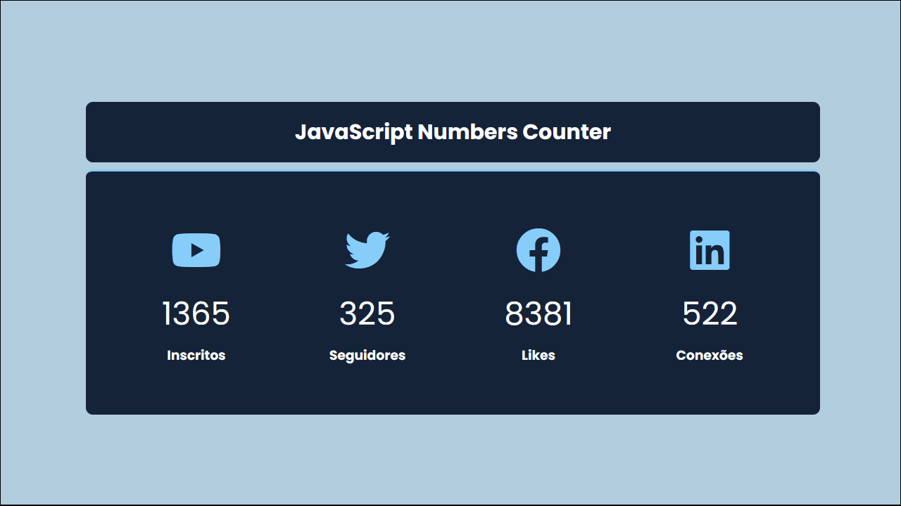

# 📄 JavaScript Numbers Counter

Um contador de números bem simples, muito usado pra mostrar números de seguidores ou clientes de plataformas digitais.

## 💻 Visualização do arquivo

## 🧪 Tecnologias usadas

Esse projeto foi desenvolvido apenas com essas tecnologias:

- [HTML](https://html.com/)
- [CSS](https://developer.mozilla.org/en-US/docs/Web/CSS)
- [JavaScript](https://www.javascript.com/)

## 📝 Licença MIT

Esse projeto está sob a licença MIT. Veja o arquivo [LICENSE](LICENSE) para mais detalhes.

---
